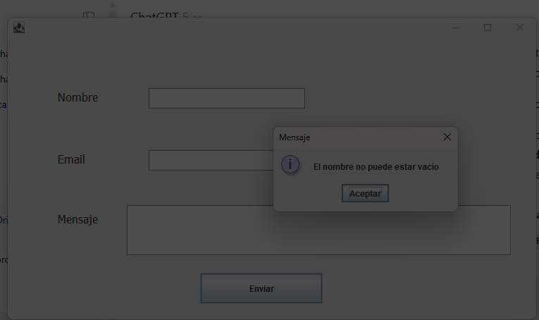
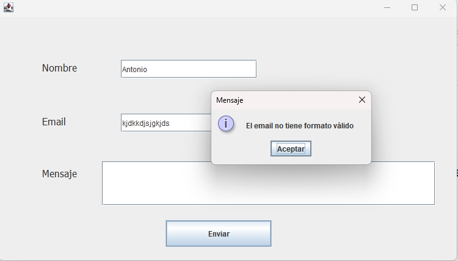
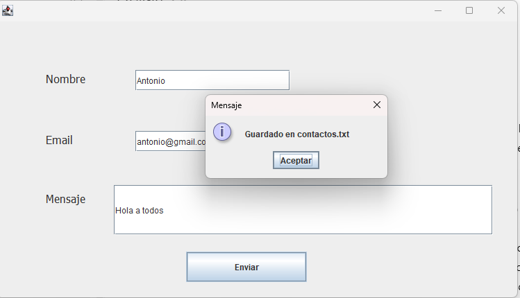

# 📌 Formulario de Contacto – Java Swing

Aplicación de escritorio desarrollada en **Java** con **Swing**.  
Permite introducir **nombre, email y mensaje**, valida los campos y guarda los datos en un fichero de texto (`contactos.txt`).

---

## ✨ Funcionalidades
- Interfaz gráfica con **Swing**.  
- Validación de entradas:  
  - Nombre y mensaje no pueden estar vacíos.  
  - Email debe tener un formato válido.  
- Persistencia en fichero de texto plano (`contactos.txt`).  
- Diseño modular:  
  - `Contacto` (modelo de datos con `toString`).  
  - `Validador` (reglas de validación).  
  - `ficheroContacto` (gestión de guardado).  
  - `FormularioContacto` (interfaz principal).

---

## 🚀 Ejecución

1. Clonar el repositorio:
   ```bash
   git clone https://github.com/JorgeToquero/formulario-contacto-java.git

   
javac src/formularioContacto/*.java

java -cp src formularioContacto.Inicio


📸 Capturas

Formulario vacío:  


Validación de campos:  


Salida guardada en fichero:  



📂 Ejemplo de salida en contactos.txt
Nombre: Antonio
Email: usuario@gmail.com
Mensaje: Hola a todos
----------------------------------------------

🛠️ Tecnologías

Java 23

Swing (interfaz gráfica)

BufferedWriter para persistencia en fichero

🔮 Posibles mejoras

Guardar en formato CSV o JSON.

Conexión a base de datos (SQLite/MySQL).

Envío de email al registrar un contacto.

Tests unitarios con JUnit.
